# 物理 AI 的建模： 从 VLA 到 World Model

从 ChatGPT 开始，LLM 的能力重心经历了一次清晰的迁移：先是通过大规模预训练理解互联网语义，再通过 instruction tuning 学会按人类任务格式工作，最后通过 RL、工具调用和可验证任务，逐渐能在数字世界里完成更长程、更复杂的行动。

类似的浪潮正在物理世界的 AI 中发生：VLA 让机器人第一次真正接上了互联网语义；World Model 则让机器人开始真正理解世界，并建模动作如何改变物理世界。

过去几年，Vision-Language-Action Model（简称 VLA）成为了机器人学习领域最重要的范式之一。它的核心思想很直观：把视觉、语言和动作融合进同一个模型中。只要输入当前画面和自然语言指令，它就能直接输出机器人接下来的动作。从 OpenVLA、GR00T 到 RT 和 $\pi$ 系列，这些前沿工作都在不断证明这条路线的巨大潜力。以最近的 $\pi_{0.5}$[^pi05] 为例，它将不同种类机器人的操作经验与海量的互联网图文数据结合在了一起。这种融合让机器人真正具备了跨场景的泛化能力——你可以直接让它置身于一个从未见过的陌生厨房或卧室，它依然能听懂指令，连续完成物品整理等复杂的长程家务任务。

然而，VLA 的成功也让我们看清了它的能力边界：它精通“名词”，极擅长语义知识的迁移，却未必真正懂“动词”。得益于海量的图文训练，它可以一眼认出 Taylor Swift，甚至能把一听可乐准确地推到她的海报旁边。可是，当你要求它去解开一根鞋带、倒一杯水、叠好一件柔软的衣物，或是把罐头严丝合缝地塞进杯口时，挑战的性质就完全变了。此时，机器人面对的不再是屏幕里的语义分类，而是极其硬核的真实物理世界——它必须处理复杂的接触与摩擦、克服视觉遮挡与物体形变，还要时刻对抗几何约束和连续动作带来的误差积累。

这也是为什么 2026 年大家开始关注 World Model：Sora、Veo、Genie、Cosmos、World Labs、DreamDojo、WorldGym、DreamZero 同时把这个概念推到了台前。同时，World Model 的内涵又非常丰富，在视频生成，机器人控制、自动驾驶等领域都有非常广泛的应用。但在这些令人眼花缭乱的应用和前沿模型背后，究竟什么是真正对物理 AI 有意义的 World Model？我们需要先回到它的核心问题定义。

## 1. World Model 的问题定义

World Model 不是某种具体模型架构，而是定义了一个重要问题：给定当前观测、内部状态、动作以及不可观测的不确定性，模型要预测世界接下来会如何变化。Yann LeCun 对 World Model 给出如下形式化描述 [^lecun]：

$$
\begin{aligned}
h(t) &= \text{Enc}(x(t)) \\
s(t + 1) &= \text{Pred}(h(t), s(t), z(t), a(t)) \\
x(t + 1) &= \text{Dec}(s(t + 1)) \quad\quad (\text{optional})
\end{aligned}
$$

其中符号含义如下：

| 符号       | 形式化含义                      | 对物理机器人意味着什么                                               |
| :------- | :------------------------- | :-------------------------------------------------------- |
| $x(t)$   | 当前观测 (Observation)         | 机器人的原始传感器数据流（相机图像、深度点云、触觉读数、本体状态）                         |
| $h(t)$   | 观测表示 (Representation)      | 从高维感官数据中提取的紧凑特征，剥离了对控制与预测无用的冗余细节（如背景光影变化）                 |
| $s(t)$   | 世界状态估计 (State)             | 系统内部对物理世界的抽象建模（物体空间位姿、速度、接触关系、机器人的全局姿态）                   |
| $a(t)$   | 动作计划 (Action)              | 机器人计划执行的控制指令（关节控制、末端位姿增量、夹爪开合、移动底盘控制）                     |
| $z(t)$   | 潜在不可观测变量 (Latent Variable) | 无法从当前观测中读取，但会改变演化结果的真实世界参数（未知的摩擦力、遮挡物背后的突变、传感器噪声、不可预见的扰动） |
| `Enc()`  | 状态编码器 (Encoder)            | 将复杂的感官观测 $x(t)$ 映射到表示空间 $h(t)$                            |
| `Pred()` | 核心预测器 (Predictor)          | 真正的“世界动态”推理引擎：给定当前状态和提议动作，推演“物理世界接下来会演变成什么样”              |
| `Dec()`  | 解码器 (Decoder)              | 将预测的抽象状态渲染回像素视频流（仅为可视化验证所需，LeCun 强调应将像素渲染与核心的状态预测严格分离）    |

我们可以用下图来表示 World Model 的架构[^vai_world_model]：

注意最后一行：`Dec()` 是 可选的，而不是 World Model 的必要条件。这点看似细节，实际上是很多争论的中心。许多视频生成模型看起来像 World Model，因为它们能生成未来画面。但如果模型只是把过去的像素延展成一段好看的视频，它未必真的学到了可用于控制的状态转移。对机器人、自动驾驶等应用来说，关键不是画面漂不漂亮，而是模型是否知道：如果夹爪往左 2 厘米、下降 1 厘米、闭合 30%，罐头会不会被夹住？如果罐头靠近杯口但释放高度偏高，它会掉进杯子、卡在杯沿，还是滚到桌上？

所以，正如 LeCun 刻意将二者分离所强调的：世界模型的核心任务是对底层状态演化进行**可控预测（controllable prediction）**，像素级的渲染（`Dec()`）仅仅是一个可选的解码扩展（Decoder Extension）。渲染能力固然有用，它让人类能直观验证模型“想象”的未来是否符合物理规律，也为策略评估和调试提供了可视化接口。但模型究竟该把多少算力容量（capacity）投资于还原不可预测的像素细节，而不是留给抽象的推理与控制，这恰恰是当前各大 World Model 流派之间最根本的分歧点。

还有一个容易被忽略的点：world model 不是单纯的视觉预测器，而是一个关于干预的模型。普通视频预测可以只学习 $p(x_{t+1}\mid x_{\le t})$，也就是在不给动作的情况下预测画面自然延续。这样的模型能学到不少物理统计规律，例如人走路时腿会如何摆动，水面会怎样起波纹，车在路上会沿车道移动。但机器人、自动驾驶等真正需要的是 $p(s_{t+1}\mid s_t,a_t)$ 或 $p(x_{t+1}\mid x_{\le t},a_t)$。这里的 $a_t$ 不是附加条件那么简单，它让模型从“观看世界”变成“介入世界”。

因此，一个机器人 World Model 至少要回答四层问题。

| 层级                      | 核心问题                                      | 物理世界示例                                    | 对控制策略的价值                                            |
| :---------------------- | :---------------------------------------- | :---------------------------------------- | :-------------------------------------------------- |
| **表示 (Representation)** | 当前系统处于什么底层抽象状态？($s_t, h_t$)               | 从高维像素中剥离光影，提取罐头位姿、杯口朝向及夹爪开合度              | 跨越感官鸿沟，为Policy 提供去噪、紧凑且稳定的状态估计                      |
| **动态 (Dynamics)**       | 包含不可观测变量 ($z_t$) 时，世界将如何自主演化？             | 无动作干预时，滑动罐头受未知摩擦力 ($z_t$) 影响何时停下，或门是否继续摆动 | 建模环境惯性与物理的不确定性，帮助机器人预测被动风险                          |
| **干预 (Intervention)**   | 注入控制指令 ($a_t$) 后，底层状态 ($s_{t+1}$) 将如何被改变？ | 夹爪下降至目标点是否会发生刚性碰撞，或特定的推力将如何改变杯子空间位姿       | 实现可控预测(Controllable Prediction)，支持反事实推理、避障纠错与前向规划   |
| **价值 (Value)**          | 在模型推演出的多元平行未来中，哪一条轨迹最符合目标？                | 根据前向状态推演判断：罐头落入杯底 (Reward>0) 显著优于卡在杯沿     | 提供规划器 (Planner) 的动作选取评分，或作为 Training Gym 中的 RL 奖励信号 |

当前学术界对于 World Model 的路线争议，本质上正是对上述四个层级的不同侧重与取舍。这些分歧触及了物理系统建模的底层哲学：模型应当压缩保留哪些信息？前向预测应该在像素空间还是高度抽象的隐空间（Latent Space）进行？策略网络与世界模型是否应当解耦？以及最核心的分歧点——系统究竟需不需要将预测状态重新渲染（Dec()）为人类可读的视觉画面？

## 2. 四类 World Model

对上述哲学问题的不同回答，直接催生了当前 World Model 领域的四种主流技术范式：Generative World Model、Latent Dynamics、JEPA 与 3D Neural Representation。

| 技术范式 (Paradigm)       | 代表性工作                            | 核心预测空间                | 核心优势 (Strengths)                                          | 核心局限与挑战 (Limitations)                                              |
| :-------------------- | :------------------------------- | :-------------------- | :-------------------------------------------------------- | :----------------------------------------------------------------- |
| **Generative Models** | Sora, Genie 3, Cosmos, DreamDojo | Observation Space     | 极易利用海量视频实现 Scale-up；自带极强渲染能力，完美契合数据合成引擎与安全红蓝对抗评估。         | 易发生自回归漂移 (Drift) 与违背常识的物理幻觉；模型算力被过度消耗于“画图”，而非推演底层的物理因果状态。          |
| **Latent Dynamics**   | PlaNet, Dreamer 系列, TD-MPC       | Latent State & Reward | 专为 Model-Based RL 打造；脑内想象成本极低，能直接在内部端到端训练 Policy 和 Value。 | 隐空间表征高度依赖特定任务环境与 Reward 信号的塑造，极易陷入任务特化，在开放世界泛化上存在天花板。              |
| **JEPA**              | V-JEPA 2.1, LeWM                 | Learned Embeddings    | 坚决摒弃像素重构损失，避免将算力浪费在不可预测的高频噪声上；提供纯粹、任务无关的自监督动态先验。          | 体系内原生缺乏动作生成与价值判断模块；在实机部署时，必须高度依赖 MPC (模型预测控制) 等外挂规划器实现闭环。          |
| **3D Neural Models**  | NeRF, 3DGS, World Labs Marble    | 3D Representation     | 提供易于渲染的 3D 空间；支持自由探索，能无缝接入 Isaac Sim 等成熟的传统机器人仿真工具链。      | 本质上是静态场景库而非动态引擎；具有极强的空间编码 `Enc()` 却缺乏原生时间预测 `Pred()`，物理接触与演化须另建模型。 |
|                       |                                  |                       |                                                           |                                                                    |

第一类是**生成式模型（Generative Models）**，这也是目前公众感知度最高的一条路线。NVIDIA 的 Cosmos[^cosmos] 将这类 World Foundation Model 定义为“物理世界的数字孪生”，它通过吞吐从 2000 万小时原始视频中精筛出的约 1 亿个高质量片段，致力于打造一个可供下游任务后训练的通用世界先验。这条路线的战略优势极其显著：视频作为互联网上最易获取、最具规模扩展性的物理经验载体，能够让模型在无需人工标注的情况下，内化海量关于几何、光影、运动学与人类行为的物理常识。顺延着这一逻辑，DreamDojo[^dreamdojo] 进一步将大规模生成范式推向了机器人实控场景。它不仅利用 4.47 万小时的第一视角（egocentric）人类交互视频预训练了世界模型，更创造性地引入了连续潜动作（continuous latent action），成功从无动作标签的真实视频中提取出了可用于控制的代理动作（proxy action），从而在纯视觉预测与物理实控之间架起了一座关键桥梁。

第二类是 model-based RL 的经典路线。PlaNet[^planet]、Dreamer[^dreamer]、TD-MPC[^tdmpc] 这类方法不直接预测像素，而是在压缩的 latent state 里预测未来，再在模型“想象”的 rollout 中训练策略和值函数。Ha 和 Schmidhuber 早期的 World Models[^worldmodels]、Hafner 的 Dreamer 系列模型都证明了：如果 latent dynamics 足够好，agent 可以在内部模型里学习，减少真实环境交互成本。

第三类是 JEPA。JEPA 的观点更激进：不要预测像素，预测 high-level embedding。因为世界里有大量不可预测细节，例如树叶晃动、传感器噪声、纹理细节、背景行人，如果强迫模型逐像素还原，会把容量浪费在对控制没有帮助的东西上。V-JEPA 2.1[^vjepa21] 的工作进一步强调 dense spatio-temporal representation：它通过 dense predictive loss 和 deep self-supervision 改善局部结构，使视频自监督表示同时支持预测、理解和机器人规划。

第四类是 **3D 表示（3D Representation）路线**。以 NeRF[^nerf] 和 3D Gaussian Splatting[^3dgs] 为代表的技术，致力于将物理场景编码为可高保真渲染、可自由探索的三维空间结构。对于具身智能而言，3D 几何先验具有不可替代的价值：机器人的物理交互（如碰撞检测、六自由度抓取、空间规划）天然建立在精确的空间关系之上。然而，纯静态的 3D 表示还不能等同于完整的世界模型。它们本质上解决的是空间维度的新视角合成，擅长回答“从另一个视角观测世界是什么样”；却缺乏对时间与交互维度的物理动力学建模，无法回答“如果我执行特定动作（如推倒杯子），场景状态会如何演变”。

从具身智能系统的全局视角来看，这四条技术路线并非相互孤立，而是有望在未来的统一架构中发挥互补的系统级作用：**Generative Models** 扮演着高保真的视觉仿真引擎，为模型注入海量的物理常识；**Latent Dynamics** 则是策略训练与强化学习的隐式沙盒，负责高效的内部规划推演；**JEPA** 定位于通用感知与预测表征层，致力于过滤环境噪声并提取核心时空状态；而 **3D Representation** 则构筑了底层的空间几何工作台，为机器人的实控操作提供精确的三维空间约束。

面对如此多样的路线，如何将它们统一到一个标准框架下进行调用、评测与集成，成为了一个重要的工程课题。OpenWorldLib[^openworldlib] 尝试给出一个系统性的解法。它定位为“世界模型方法库与统一推理框架”，将交互式视频生成、3D 场景重建、空间/多模态推理以及 VLA 等任务整合进一套标准接口中。其核心抽象遵循 `Pipeline -> Operator -> Synthesis / Reasoning / Representation -> Memory` 的层级结构：

1. **Operator（算子模块）**：作为连接异构感知输入与物理世界交互（如视觉流、指令控制、机器人动作）的桥梁，负责信号的预处理和标准化。
2. **Synthesis / Reasoning / Representation（核心能力模块）**：对应前文提到的不同能力组件。其中 Synthesis 负责隐式表征渲染与动作合成（常用于 Generative 路线）；Representation 负责显式 3D 表达（常用于 3D 路线），弥合物理仿真鸿沟；Reasoning 负责复杂的时空与因果推演。
3. **Memory（记忆模块）**：世界模型的持久化状态中心，记录多轮交互中的感知流与动作历史，维持智能体的时序连贯认知。

这一套统一的框架抽象不仅包容了四类路线的差异，也让单一模型向多维混合架构（Hybrid Runtime）的演进成为可能。

这个视角也能解释为什么 Cosmos[^cosmos] 重要性，它不只是单个视频模型，而是把数据工程、tokenizer、预训练 WFM、post-training 样例和 guardrail 作为一个平台来组织。它给 Physical AI 提供可定制调优的世界先验：先在大规模视频里学习通用动态，再针对机器人、自动驾驶、相机控制等具体场景后训练。对于技术落地来说，这种平台化比单个模型更有价值，因为真正困难的是把世界模型纳入持续迭代的训练、评测和部署流程。

DreamDojo[^dreamdojo] 则展示了一个更接近机器人需求的 World Model 版本：它基于 Cosmos-Predict 模型引入 continuous latent action，让大规模无动作标签的人类第一视角视频也能成为 action-conditioned world modeling 的训练材料。这个设计背后的直觉非常朴素：人类视频虽然没有机器人关节标签，但相邻帧之间必然存在导致变化的动作因素。用一个带信息瓶颈的 latent action model 把这种动作因素压缩出来，就能把“看人类做事”变成“学习动作如何造成变化”。

## 3. VLA 的优势与天花板

VLA 的成功源于一种非常自然的范式迁移：既然大视觉语言模型（VLM）已经内化了海量的对象知识、常识推理与指令理解能力，我们顺理成章地将“动作”也接入了同一个框架。这使得机器人首次系统性地继承了广阔的互联网语义——它不仅能准确识别可乐罐、杯子、抽屉、毛巾或是 Taylor Swift 的照片，也能领会“把 A 放到 B 上”、“打开柜门”或“擦掉污渍”等指令的大致含义。正如 $\pi_{0.5}$[^pi05] 所证明的那样，通过异构数据联合训练，我们确实能将网页图文先验、语义子任务与跨本体的机器人动作数据融合在统一框架内，从而在新环境中展现出可观的泛化能力。

然而，问题的硬币还有另一面：许多 VLA 的内部能力重心实质上更倾向于 Language-Vision-Action，而非真正均衡的 Vision-Language-Action。强大的视觉与语言先验让它们极擅长将任务描述与视觉对象对齐，但在真正输出“动作”时，模型往往缺乏对物理演化规律的内在理解，未能建立起足够鲁棒的动作条件动态模型（Action-conditioned Dynamics）。

这种“重语义，轻物理”的特性，在机器人实机部署时划出了一道非常具体的能力分水岭：

| 能力维度 | VLA 相对擅长的领域（依赖语义先验） | VLA 相对薄弱的领域（依赖物理常识与动力学） |
| :--- | :--- | :--- |
| **名词泛化** | 识别新物体、新类别、理解开放词表（Open-vocabulary）目标 | 区分外观相似但物理属性（材质、重量、摩擦力）不同的物体 |
| **语义泛化** | 将高维语言指令精准锚定至物理空间中的视觉特征 | 将抽象任务稳定拆解为符合物理法则的连续底层控制动作 |
| **动词泛化** | 执行训练集中高频的基本技能（Pick / Place / Open） | 处理 unseen verbs、复杂物理接触、柔性体或解结 |
| **环境泛化** | 适应静态的背景切换或简单的目标对象替换 | 抵抗动态干扰、光照/视角突变、目标位姿扰动及空间遮挡 |
| **长程执行** | 在有明确高层状态机支持时表现优异 | 实施局部错误恢复、维持长时接触状态、以及动作失败后的即时重规划 |

## 4. 实验观察：VLA 在物理泛化中的局限

我们在本地环境的仿真评测也明确印证了这一泛化瓶颈。依托 RTX 6000 计算平台，我们对 $\pi_{0.5}$ VLA 模型的实际物理控制能力进行了压力测试。

在基于 ISAAC Sim 的 `put the can in the mug` 任务中[^sim_evals]，这本是一项非常标准的基础取放（Pick-and-place）操作。然而，当我们向场景中显式注入目标物位姿（Object pose）、容器位姿（Container pose）、动态干扰物（Distractor）以及光照与相机视角的联合扰动后，模型在 10 个测试回合（Episode）中的成功率从无扰动时的 100% 断崖式跌落至 50.0%。深入剖析其运动轨迹，我们发现失败案例高度集中于三种典型的物理失效模式：抓取目标后未能保持稳定的空间运输轨迹；到达容器边缘后未能完成精确对齐与有效释放，导致目标物丢失；以及面对复杂扰动时策略直接陷入停滞（全程无有效进展）。

**实验状态与成功/失效模式图解：**

*成功样例:*

|                t = 0s：初始状态                 |                   t ≈ 3s：接近/抓取                   |                  t ≈ 5s：对准杯口                   |                      t ≈ 6s 成功                      |
| :----------------------------------------: | :----------------------------------------------: | :--------------------------------------------: | :-------------------------------------------------: |
| 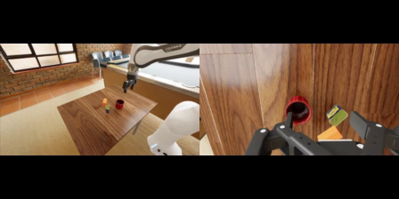 | 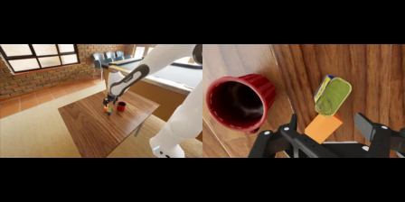 | 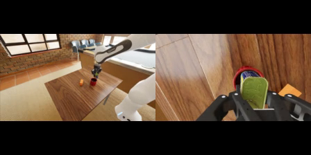 | 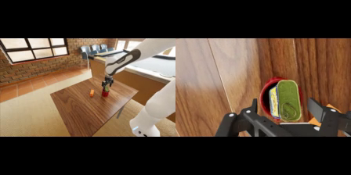 |

*失败模式 1: 抓取后缺少稳定运输策略*

| t ≈ 12s：罐头已被抓起抬离桌面 | t ≈ 24s：仍未运输到杯子附近 | t ≈ 29s：超时，罐头远离目标 |
| :---: | :---: | :---: |
| 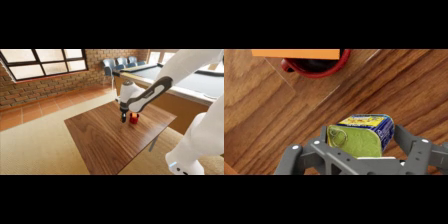 | 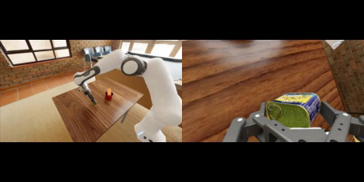 | 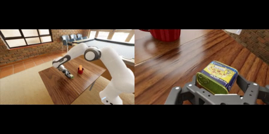 |

*失败模式 2: 到达目标附近但未完成有效释放，罐头丢失*

|                                                                 t ≈ 15s：罐头靠近杯口                                                                 |                                                                   t ≈ 21s：罐头被带离/丢失                                                                   |                                                               t ≈ 29s：超时，目标区域空                                                               |
| :--------------------------------------------------------------------------------------------------------------------------------------------: | :--------------------------------------------------------------------------------------------------------------------------------------------------: | :------------------------------------------------------------------------------------------------------------------------------------------: |
| 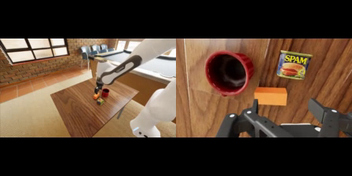 | 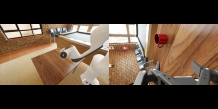 | 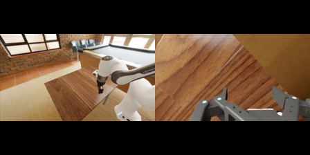 |

*失败模式 3: 无有效进展而失败*

|                     t ≈ 6s：初始阶段无有效动作                      |                     t ≈ 15s：中段仍无进展                      |                        t ≈ 29s：超时，始终 未成功                        |
| :-------------------------------------------------------: | :-----------------------------------------------------: | :-------------------------------------------------------------: |
| 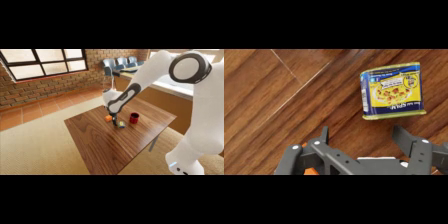 | 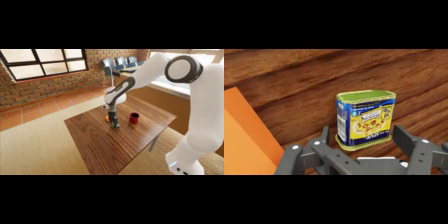 | 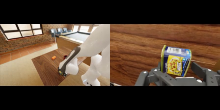 |

这个例子很有代表性。把罐头放进杯子，看起来像一个简单的语言目标，实际却包含目标定位、抓取、运输、杯口几何对准、释放高度、保持时间和视觉遮挡。策略如果只学到“靠近杯子”，还不够。它必须知道物体在接触和释放之后会怎样。

再看 $\pi_{0.5}$ 在 LIBERO spatial 上的本地微调实验：step 2000 时，总成功率为 74.6%；继续训练到 step 6000 后，总成功率提升到 95.8%。提升很明显，但最难的 task 仍然是从木柜顶层抽屉中取碗并放到盘子上，成功率从 44% 提升到 80%，仍低于其他桌面可见目标任务。

这些评测结果并未否定 VLA 的价值，而是清晰划定了它的能力边界：当任务从“语义泛化”深入到真实的“物理与运动泛化”时，单纯的视觉与语言先验已然不够。机器人需要的不再是更懂“名词”的模型，而是真正理解“动词（Verbs）”的物理引擎。

人类口中的“放进去”，在真实世界里包含着对摩擦力、物体形变、空间避障与连续姿态的复杂把控。VLA 的核心局限在于，它本质上是“从图像映射到动作”的模仿学习器，而非“理解动作如何改变未来状态”的因果推演模型。一旦脱离训练分布——例如将刚性的方块换成软海绵、将大口碗换成极窄的杯口——虽然任务的“语义”没变，但底层的“物理特性与接触动力学”已截然不同。面对这种变化，缺乏物理推演能力的纯模仿策略将变得极其脆弱。

## 5. 从 VLA 到 World Model

基于上文的分析，VLA 范式的核心局限已然显现：它缺乏对动作与未来物理状态之间因果关系的建模。这正是 World Model（世界模型）试图补齐的最底层短板。

VLA 的原生范式是“指令跟随”（Instruction Following）——模型将当前观测和语言目标端到端地映射为动作输出。这使其在处理开放词汇目标、长程任务分解和对象语义泛化时如鱼得水。然而，机器人控制真正困难的地方，往往不在于“理解目标是什么”，而在于“理解执行这个动作后，世界是否会如期向目标状态演进”。为此，World Model 将问题的核心从“动作预测”（Action Prediction）重构为“未来预测”（Future Prediction）：给定当前状态与候选动作，推演世界接下来的演化轨迹，并以此作为评估候选策略、前向规划或训练动作策略的基石。

这两种范式的底层逻辑差异可以总结如下：

| 范式 | 核心问题 | 典型接口 | 核心优势 | 局限性与挑战 |
| :--- | :--- | :--- | :--- | :--- |
| **VLA** | 在当前观测与指令下，应当采取什么动作？ | $a_{t:t+H}=\pi(o_{\le t}, c)$ | 语义推理、开放词汇目标理解、专家轨迹模仿 | 分布外物理变化、复杂接触处理、长程错误累积与失败恢复 |
| **World Model** | 在给定动作干预后，物理世界将如何演化？ | $\hat{s}_{t+1}=f(s_t,a_t,z_t)$ | 物理规律内化、动作后果预测、反事实经验生成 | 复合误差（长程漂移）、模型物理幻觉、动作条件可控性 |

这也是具身智能从 VLA 演进至 World Model 的核心逻辑：从“盲目的动作模仿”走向“基于动作后果的因果推演”。具体而言，World Model 有望在未来的机器人系统中扮演四种关键角色：

第一，**评估器（Evaluator）**。面对相同的初始观测与任务目标，VLA 往往会输出多个候选的动作序列（action chunks）。World Model 能将这些候选动作“前向展开”（rollout）为多条未来轨迹，随后交由 VLM 奖励函数、规则检查器或几何约束模块进行打分。WorldGym[^worldgym] 充分验证了这一思路：它以真实初始帧作为起点，在 World Model 中运行 VLA 策略，并利用 VLM 评估结果，最终获得了与真实世界测试高度一致的反馈。这种机制将高昂的物理试错成本，成功转化为了低成本的“脑内推演”。

第二，**规划器（Planner）**。策略模型无需一步到位输出最终解，而是可以先提出若干短程（short-horizon）的探测性方案，交由 World Model 预测各自的物理后果，从而筛选出最贴近目标且风险最低的轨迹加以执行。在这一过程中，并不强求 World Model 达到像素级的完美还原，只要它在鉴别“关键失败模式”（如碰撞、掉落）时，比盲目的启发式策略具备更敏锐的物理直觉即可。

第三，**训练场（Trainer）**。鉴于真实机器人的交互数据极其昂贵，World Model 内部的“想象轨迹”（imagined rollouts）可直接充当强化学习（RL）或测试期自适应（Test-time Adaptation）的高保真虚拟环境。World-Gymnast[^worldgymnast] 便在此基础上，利用想象轨迹和 VLM 奖励信号进行 RL 闭环训练，大幅拉升了策略上限。不仅如此，在应对物理分布偏移时，诸如 WorldAgen[^worldagen] 等研究还将世界模型从“静态预训练引擎”升级为“动态更新环境”。机器人仅需在部署现场收集极少量的交互数据，便可借助 LoRA 等轻量化技术对 World Model 进行在线微调（Test-Time Training），使其迅速内化新环境的物理动态，进而引导更为精准的自适应规划。

第四，**数据引擎（Data Engine）**。World Model 能够自由合成新的相机视角、复杂背景、目标位姿乃至动态干扰物，甚至能从真实的次优轨迹中凭空构造出反事实事件（Counterfactual Events）：“如果当时夹爪再降低两厘米、释放时机再晚半秒，任务会成功吗？” 这种源源不断合成的长尾失败恢复（failure recovery）与反事实交互数据，正是传统遥操作（Teleoperation）极其匮乏且难以低成本获取的稀缺资源。

在这样一个高度自洽的闭环中，World Model 提供了一个安全、低成本的物理试错沙盒。VLA 负责捕捉并将人类的语义意图接入系统，World Model 负责推演动作干预后的物理后果，reward/verifier 负责评判未来轨迹的优劣，而真实的物理交互数据则被源源不断地用于校准与迭代模型。只有当这四大组件有机融合，物理世界的基础模型，才能真正跨越“语义理解”的舒适区，迈向坚实的“物理泛化”。

## 6. 从 World Model 到可执行策略

在此基础之上，学术界与产业界正在向一种新的范式发展：将 World Model 与 Policy 深度融合，实现视频预测与动作生成的联合建模。Nvidia GEAR 团队在 DreamZero[^dreamzero] 中将这类架构正式统称为 World Action Model (WAM)，而类似的思想也已广泛体现在 Genie Envisioner[^genie_envisioner]、GR-2[^gr2]、Cosmos Policy[^cosmos_policy] 等一系列前沿工作中。当模型不仅预测物理世界的未来状态，还能同时预测“要实现这一未来需要怎样的干预动作”时，它便从一个单纯的环境观察者，跨越成为可执行的闭环控制策略。

从形式化定义的角度来看，传统的 VLA 范式可以表示为：

$$
\pi(a_{t:t+H}\mid o_{\le t}, c)
$$

即给定历史视觉观测 $o_{\le t}$ 和语言指令 $c$，直接预测未来动作块（Action Chunk） $a_{t:t+H}$。这在本质上仍然是行为克隆（Imitation Learning）的逻辑：将当前观测与训练集分布进行特征匹配，进而模仿专家在相似状态下的动作模式。

相比之下，WAM 范式则将其重构为一个联合生成（Joint Modeling）问题：

$$
p(o_{t:t+H}, a_{t:t+H}\mid o_{\le t}, c, q_t)
$$

在这里，$o$ 代表外部视觉观测（如相机帧），而 $q_t$ 则是机器人的本体感知状态（Proprioceptive state，如当前的关节角度与末端位姿）。模型不再孤立地预测动作，而是将动作与对应的视觉未来在同一个生成过程中联合对齐。

这种联合建模带来了根本性的变化：视频预测作为一种密集的世界模型监督信号（Dense World-model Supervision），通过轨迹中的每一帧强制模型内化“世界将如何变化”的物理常识；而动作预测则自然退化为一个逆动力学（Inverse Dynamics）问题——为了让当前的视觉状态合乎逻辑地演变成预测的未来，机器人应当施加怎样的物理干预？

换言之：VLA 学习的是“**看到这个状态时，专家做了什么**”；纯粹的 World Model 学习的是“**执行动作之后，世界会怎样演变**”；而 WAM 则进一步内化了因果关系——“**如果物理世界应该演变成这样，机器人本体需要如何行动才能促使它发生**”。

最理想的 WAM 不仅仅是输出一段动作序列，而是在其内部生成一个高度约束的可执行未来。当它“想象”夹爪靠近杯子时，输出的连续动作序列必须精确对应真实物理空间中的趋近轨迹；当它“想象”罐头塞入杯口时，动作序列就必须严密包含运输、几何对准、释放以及稳定保持等物理接触过程。由此，动作不再是一个悬空的抽象向量，而是一个被未来视觉状态与物理常识严格约束的因果行动计划。

这同样解释了为什么 WAM 在面对未见过的动作（Unseen Verbs）时展现出极其强大的泛化潜力。即便机器人从未被直接示教过“如何解开绳结”，只要模型从海量的互联网视频先验中“看”懂了人类解结时的空间与拓扑变化，它便能通过逆动力学机制，将这种纯视觉的演化逻辑映射回机器人的低层动作空间，从而自然涌现出高度合理的初始策略。

### DreamZero 代表案例

NVIDIA 近期提出的 DreamZero[^dreamzero] 是当前最适合说明 World Model 如何与策略深度融合的标杆工作。它摒弃了“先训世界模型，再外接逆动力学（IDM）或规划器”的拼凑式路线，直接将 140 亿参数的视频流匹配（Flow Matching） DiT 扩展为联合视频-动作去噪器（Joint Video-Action Denoiser）。通过在同一个 Transformer 序列中引入视频 Token 与动作/状态寄存器（Registers），DreamZero 实现了未来视觉与未来动作的同步自回归预测。

在工程与架构上，DreamZero 有几个极具启发性的核心设计：

第一，**原生继承大规模视频先验**。它的 Backbone 直接采用了预训练的图像到视频（I2V）扩散模型（如 Wan2.1-I2V-14B[^wan21]），将当前与历史视觉观测、语言指令和机器人本体感知（Proprioceptive State）作为联合条件输入。这使得模型无需从零学习物理规律，而是直接继承了互联网海量视频中蕴含的光影、几何与碰撞常识。

第二，**统一架构内的联合预测（Joint Prediction）**。DreamZero 将视频预测与动作生成在训练阶段深度融合、相互制约。预测出的视频必须符合物理逻辑，而生成的动作必须能刚好导致视频中的状态演化，从而实现了视觉与控制的强对齐。此外，为了让庞大的扩散模型能在机器人上实时运行，团队引入了创新的 DreamZero-Flash 机制：它在训练时巧妙地将视频和动作的加噪过程分开，故意让视频端保持高噪声的“模糊”状态，强迫模型学会“即使脑海中想象的未来画面还很模糊，也能稳稳提取出清晰、精确的物理动作”。这一设计极大压缩了推理所需的扩散步数，将实控频率大幅提升至约 7Hz，彻底跨越了实时闭环控制的门槛。

第三，**基于真实观测闭环的误差回填**。为解决自回归生成常见的长程漂移（Drift）问题，DreamZero 引入了“真实世界刷新”机制。在实机部署时，每执行完一个动作块（Action Chunk），系统便将 KV Cache 中模型“想象”的预测帧强行替换为真实相机拍摄的新观测帧，彻底切断了闭环控制中的误差累积。

DreamZero 的表现充分印证了 WAM 范式在物理泛化上的颠覆性潜力。它证明了机器人无需依赖海量、高成本的实机动作数据来创造泛化“魔法”，只需借助强大的视频先验指导动作生成。在 AgiBot 平台对“解开鞋带”、“熨烫衣物”等完全未知的任务（Unseen Tasks）评测中，DreamZero 展现了出色的零样本泛化（Zero-shot Generalization）能力，其表现远超现有的预训练 VLA 模型（如 GR00T 和 $\pi_{0.5}$）。此外，实验也证实了清晰的 Scaling Law——在模型扩大至 14B 参数后，更好的视频推理能力直接带来了更符合物理规律的未来推演，从而引导出更准确、鲁棒的实控动作。

<!-- 输入层 -->

历史视觉观测

↓

VAE / Video Latent

语言指令

↓

Text Encoder

本体状态 q(t)

↓

State Encoder

<!-- 汇聚桥 -->

↓

<!-- DiT 核心 + 反馈 -->

Autoregressive DiT Joint Denoising

←执行后回填

真实新观测

<!-- 分叉桥 -->

↓

<!-- 输出层 -->

Future Video Latent

Future Action Chunk

### 【TODO： DreamDojo 实验】

## 8. World Model 的数据飞轮

如果只把 World Model 理解成 3D 视频生成，那它的价值仅仅局限于设计与娱乐。但对于机器人和自动驾驶等物理 AI 而言，它的核心意义在于重塑整个研发生命周期。正如 NVIDIA 科学家 Jim Fan 在红杉 AI Ascent 上提出的观点，物理 AI 正在经历一场直接复刻 LLM 成功路径的“The Great Parallel” [^jimfan_talk]：

| LLM 路径 (GPT-3 到 o1)                          | 物理 AI 平行路径 (VLA 到 WAM)                            |
| :------------------------------------------- | :------------------------------------------------ |
| **Next-token Prediction**：预训练语言规律            | **Next-state Prediction**：用大规模视频预训练物理直觉           |
| **SFT (Supervised Fine-Tuning)**：对齐任务格式和人类偏好 | **Action Fine-Tuning**：对齐机器人特定的物理硬件与任务            |
| **RL (Reinforcement Learning)**：激发深度推理能力     | **RL in World Models**：在世界模型中做强化学习与规划             |
| **Data Flywheel**：来自用户交互和工具反馈                | **Data Flywheel**：基于真实部署、第一视角视频与世界模型想象数据融合优化的数据飞轮 |

LLM 的 RL 成功依赖于可扩展的环境反馈（如代码编译器或数学判题器），而机器人过去最缺的正是这种规模化的反馈环节——我们不可能为了跑百万级并发 RL 去建造百万台物理机器人。World Model 的根本突破，是充当了一个纯数据驱动的 神经模拟器（Neural Simulator）。它将物理世界的常识压缩进了模型中，使得 **“算力=环境=数据”**。真实世界的试错被迁移到云端的 Imagined Environments 中，变成可无限并行、可回放、可低成本试错的过程。

在这个框架下，机器人数据飞轮的构建经历了从“有人采集”到“无感飞轮”的转变，主要依赖以下四种经验来源：

| 经验来源 | 类比到 LLM | 优势 | 局限 |
| :--- | :--- | :--- | :--- |
| **Human / Egocentric Video** (如 Eagle Scale) | 预训练大规模语料库 | **“特斯拉FSD级”扩展性**，规模极大（千万小时级），覆盖全物理长尾场景 | 缺乏精确动作标签，存在实施鸿沟 (Embodiment Gap) |
| **Teleop Demonstration** / 穿戴设备 | 高质量 SFT 示范 | 动作标签绝对精准，与目标机器人 1:1 对齐 | 成本极高（面临3小时/天物理极限），难以覆盖失败恢复 |
| **World Model Rollout** (如 DreamDojo) | RL 环境自动采样 | **算力即环境**，可反事实推理，实现低成本、数百万级并发试错 | 受限于世界模型自身的精度误差，需要真实数据校准 |
| **Real Deployment Logs** | 线上用户反馈 (RLHF) | 绝对真实的物理分布，能暴露出长尾与致命性缺陷 | 部署成本极高，安全要求严苛，数据清洗难度大 |

在这个特斯拉 FSD 式的闭环中：我们首先利用海量的 **Egocentric Video**（人类第一视角视频）进行大规模预训练，让模型自主涌现重力、几何与常识；接着，利用少量极其昂贵的 **Teleop 数据**作为“引子”进行动作微调，冷启动机器人的基础策略；随后，将策略放入 **World Model Rollout** 中，利用 GPU 算力替代物理引擎和真实环境，在“想象”中完成大规模并发强化学习；最后，在真实部署中收集 **Real Logs** 来校准误差，让更新后的 World Model 能生成更逼真的仿真。

最终，机器人不再依赖人类穿着笨重繁复的传感设备进行一次次昂贵的遥操作示范。通过将海量被动人类经验、低成本的想象经验与核心的真实经验有机融合，物理 AI 将真正迎来它的“大模型时刻”——一条通往物理 AGI 的指数级进化之路。

## 9. 小结

World Model 的核心意义从来不是能否生成更逼真的视频，而是能否准确推演动作将如何改变物理世界。只有当这种对未来的预测能力能够被评估器打分、被规划器调用、被策略训练场内化，并在真实物理环境中完成校准时，它才真正从一个单纯的视觉生成引擎，蜕变为物理 AI 不可或缺的 Neural Simulator。

VLA 跨越了语义认知的鸿沟，让机器人“听懂指令、认清万物”；而 World Model 则补齐了因果推演的拼图，赋予了机器人“在脑海中试错”的物理想象力。从基于模仿学习的 VLA，到构建物理前向预测的 World Model，再到将状态演化与动作生成深度联合的 WAM（World Action Model），物理 AI 正在经历一次深刻的范式跃迁。沿着这条与 LLM 极其相似的进化轨迹，机器人的基础模型正从单向的开环执行器，坚定地迈向集感知、想象、推演与行动于一体的闭环智能体。

## References

[^lecun]: Yann LeCun. ["A Path Towards Autonomous Machine Intelligence."](https://openreview.net/forum?id=BZ5a1r-kVsf) OpenReview, 2022.

[^worldmodels]: David Ha and Jürgen Schmidhuber. ["World Models."](https://arxiv.org/abs/1803.10122) arXiv:1803.10122, 2018.

[^dreamer]: Danijar Hafner, Timothy Lillicrap, Jimmy Ba, and Mohammad Norouzi. ["Dream to Control: Learning Behaviors by Latent Imagination."](https://arxiv.org/abs/1912.01603) International Conference on Learning Representations, 2020.

[^cosmos]: NVIDIA. ["Cosmos World Foundation Model Platform for Physical AI."](https://arxiv.org/abs/2501.03575) arXiv:2501.03575, 2025.

[^vjepa21]: Lorenzo Mur-Labadia, Matthew Muckley, Amir Bar, Mido Assran, Koustuv Sinha, et al. ["V-JEPA 2.1: Unlocking Dense Features in Video Self-Supervised Learning."](https://arxiv.org/abs/2603.14482) arXiv:2603.14482, 2026.

[^nerf]: Ben Mildenhall, Pratul P. Srinivasan, Matthew Tancik, Jonathan T. Barron, Ravi Ramamoorthi, et al. ["NeRF: Representing Scenes as Neural Radiance Fields for View Synthesis."](https://arxiv.org/abs/2003.08934) European Conference on Computer Vision, 2020.

[^3dgs]: Bernhard Kerbl, Georgios Kopanas, Thomas Leimkühler, and George Drettakis. ["3D Gaussian Splatting for Real-Time Radiance Field Rendering."](https://repo-sam.inria.fr/fungraph/3d-gaussian-splatting/) ACM Transactions on Graphics, 2023.

[^pi05]: Kevin Black, Noah Brown, James Darpinian, Karan Dhabalia, Danny Driess, et al. ["$\pi_{0.5}$: a Vision-Language-Action Model with Open-World Generalization."](https://arxiv.org/abs/2504.16054) arXiv:2504.16054, 2025.

[^dreamzero]: Seonghyeon Ye, Yunhao Ge, Kaiyuan Zheng, Shenyuan Gao, Sihyun Yu, et al. ["World Action Models are Zero-shot Policies."](https://arxiv.org/abs/2602.15922) arXiv:2602.15922, 2026.

[^worldgym]: Julian Quevedo, Ansh Kumar Sharma, Yixiang Sun, Varad Suryavanshi, Percy Liang, et al. ["WorldGym: World Model as An Environment for Policy Evaluation."](https://arxiv.org/abs/2506.00613) arXiv:2506.00613, 2025.

[^worldgymnast]: Ansh Kumar Sharma, Yixiang Sun, Ninghao Lu, Yunzhe Zhang, Jiarao Liu, et al. ["World-Gymnast: Training Robots with Reinforcement Learning in a World Model."](https://arxiv.org/abs/2602.02454) arXiv:2602.02454, 2026.

[^planet]: Danijar Hafner, Timothy Lillicrap, Ian Fischer, Ruben Villegas, David Ha, et al. ["Learning Latent Dynamics for Planning from Pixels."](https://arxiv.org/abs/1811.04551) International Conference on Machine Learning, 2019.

[^tdmpc]: Nicklas Hansen, Xiaolong Wang, and Hao Su. ["Temporal Difference Learning for Model Predictive Control."](https://arxiv.org/abs/2203.04955) International Conference on Machine Learning, 2022.

[^dreamdojo]: Yingdong Hu et al. ["DreamDojo: A Generalist Robot World Model from Large-Scale Human Videos."](https://arxiv.org/abs/2602.06949) arXiv:2602.06949, 2026.

[^worldagen]: Chi Wan, Kangrui Wang, Yuan Si, et al. ["WorldAgen: Unified State-Action Prediction with Test-Time World Model Training."](https://arxiv.org/search/cs?query=WorldAgen&searchtype=all) Proceedings of the AAAI Conference on Artificial Intelligence, 2026.

[^genie_envisioner]: Yue Liao, Pengfei Zhou, Siyuan Huang, et al. ["Genie envisioner: A unified world foundation platform for robotic manipulation."](https://arxiv.org/abs/2508.05635) arXiv:2508.05635, 2025.

[^gr2]: Chi-Lam Cheang, Guangzeng Chen, Ya Jing, et al. ["GR-2: A generative video-language-action model with web-scale knowledge for robot manipulation."](https://arxiv.org/abs/2410.06158) arXiv:2410.06158, 2024.

[^cosmos_policy]: Moo Jin Kim, Yihuai Gao, Tsung-Yi Lin, et al. ["Cosmos policy: Fine-tuning video models for visuomotor control and planning."](https://arxiv.org/abs/2601.16163) arXiv:2601.16163, 2026.

[^wan21]: Team Wan. ["Wan: Open and Advanced Large-Scale Video Generative Models."](https://arxiv.org/abs/2503.20314) arXiv:2503.20314, 2025.

[^jimfan_talk]: Jim Fan. ["Robotics’ End Game: Nvidia’s Jim Fan."](https://www.youtube.com/watch?v=3Y8aq_ofEVs) YouTube, April 30, 2026.

[^openworldlib]: Bohan Zeng, Daili Hua, Kaixin Zhu, et al. ["OpenWorldLib: A Unified Codebase and Definition of Advanced World Models."](https://arxiv.org/abs/2604.04707) arXiv:2604.04707, 2026.

[^sim_evals]: ["sim-evals"](https://github.com/arhanjain/sim-evals), GitHub.

[^vai_world_model]: Vai Viswanathan. ["WTF is a World Model?"](https://x.com/vai_viswanathan/status/2050177504392998932) X, 2026.
