# DreamZero DROID Scene 2 实验日志分析报告

## 1. 实验概览

- **日志文件**：`logs/droid_roboarena_efficiency/eval_dreamzero_droid_scene2_20260516_160732.log`
- **运行目录**：`runs/2026-05-16/16-07-56`
- **任务**：DROID Sim Eval — Scene 2，指令为 `put the can in the mug`
- **任务套件 / split**：`default` / `default`（从 `run_metadata.json` 推断，无 task_suite 字段，且扰动全部关闭）
- **Variation seed**：0 | **Level**：1.0（默认值，但因扰动全关闭，实际无扰动生效）
- **扰动配置**：object_pose=off, container_pose=off, distractor=off, lighting_camera=off（全部关闭）
- **目标物体**：source 为 `_10_potted_meat_can`，target 为 `_25_mug`
- **策略**：DreamZero（通过 WebSocket 连接 localhost:6000 提供推理服务）
- **推理模式**：open-loop horizon = 8，每 8 步调用一次模型推理
- **计划集数**：10 episodes；每集上限 450 steps，控制频率 15 Hz，即每集最长 30s
- **成功判定**：水平距离 `< 0.06m`，高度差在 `(-0.02m, 0.15m)`，并需连续保持 30 steps（约 2s）
- **Early-stop**：开启，成功保持后提前结束

本次运行已完整结束，10 个 episode 全部完成，`results.json` 已正常生成。

## 2. 运行完成度与指标

| 项目 | 结果 |
| --- | --- |
| 计划 episodes | 10 |
| 完整完成 episodes | 10 |
| 保存视频 | `episode_0.mp4` ~ `episode_9.mp4` |
| `results.json` | ✅ 已生成 |
| 成功率 | **7/10 = 70.0%** |
| 平均进度 | **70.0%** |
| stage 分布 | place (success): 7, idle: 3 |
| 是否通过 strict_success_threshold (80%) | ❌ 否 |

逐 episode 摘要：

| Episode | 结果 | 总 steps | 成功 step | 成功耗时 | `h_dist` | `v_diff` | 解释 |
| --- | --- | --- | --- | --- | --- | --- | --- |
| 1 (ep0) | ✅ SUCCESS | 189 | 159 | 10.60s | 0.0064 | 0.1016 | 放置精度最高（h_dist=6.4mm），快速完成 |
| 2 (ep1) | ❌ FAILURE | 450 | - | - | 0.1410 | 0.0030 | 停留在 idle 阶段直至超时，未启动抓取 |
| 3 (ep2) | ✅ SUCCESS | 203 | 173 | 11.53s | 0.0418 | 0.1037 | 成功，但 h_dist 较大（41.8mm），接近阈值 |
| 4 (ep3) | ✅ SUCCESS | 194 | 164 | 10.93s | 0.0152 | 0.1038 | 稳定成功，精度良好 |
| 5 (ep4) | ❌ FAILURE | 450 | - | - | 0.1410 | 0.0030 | 与 ep1 完全相同的初始构型，idle 超时 |
| 6 (ep5) | ✅ SUCCESS | 265 | 235 | 15.67s | 0.0144 | 0.1107 | 成功，耗时中等 |
| 7 (ep6) | ✅ SUCCESS | 396 | 366 | 24.40s | 0.0264 | 0.1059 | **最慢成功**，可能经历了较长的探索/修正 |
| 8 (ep7) | ✅ SUCCESS | 255 | 225 | 15.00s | 0.0154 | 0.0992 | 成功，v_diff 最低 |
| 9 (ep8) | ✅ SUCCESS | 224 | 194 | 12.93s | 0.0245 | 0.1074 | 稳定成功 |
| 10 (ep9) | ❌ FAILURE | 450 | - | - | 0.1410 | 0.0030 | 与 ep1/ep4 完全相同的初始构型，idle 超时 |

> 成功的 7 个 episode 均因 `early_stop_on_success=True` 在成功连续保持 30 steps（约 2s）后提前结束。成功步数范围为 159–366，对应成功耗时 10.60s–24.40s。3 次失败的 episode 均达到 450 steps 上限后超时退出。

## 3. 截图证据

完整关键帧拼图（每 episode 6 帧，从起始到结束均匀采样）：

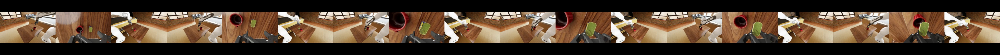

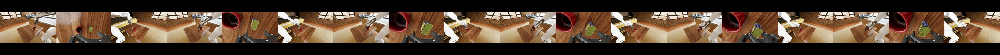

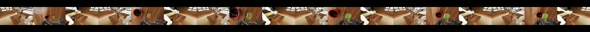

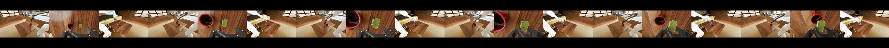

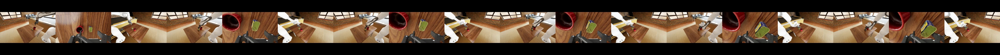

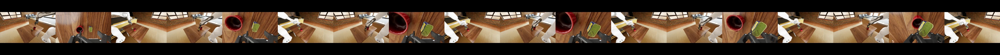

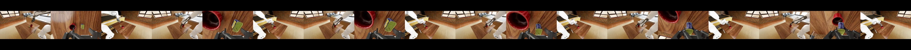

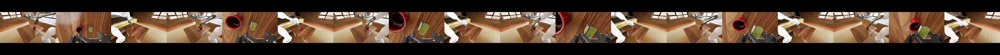

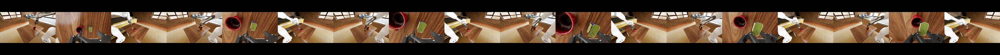

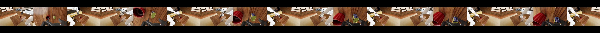

典型成功样例（Episode 1 / ep0，最高精度，h_dist=0.0064m）：

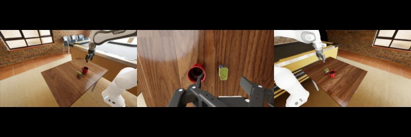

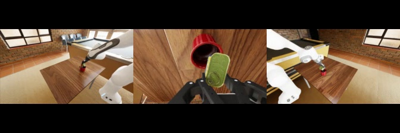

典型失败样例（Episode 2 / ep1，idle 超时）：

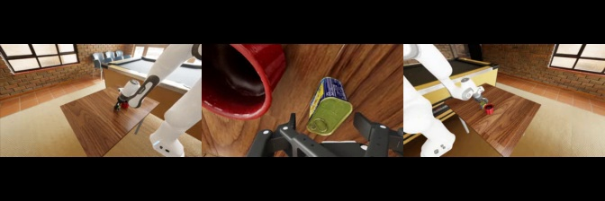

值得关注的 Episode 7 / ep6（最慢成功，24.40s）：

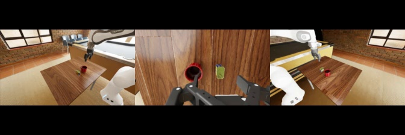

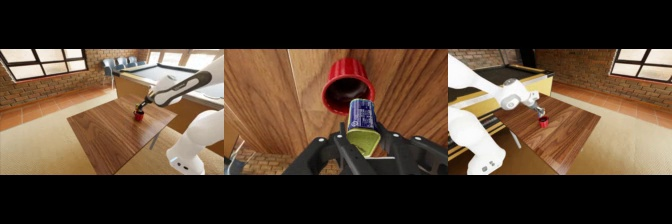

## 4. 关键统计

| 指标 | 值 |
| --- | --- |
| 成功率 | 70.0% (7/10) |
| 平均进度 | 70.0% |
| 平均成功 step | 216.6 (14.44s) |
| 最快成功 | Episode 1 (ep0): step 159 (10.60s) |
| 最慢成功 | Episode 7 (ep6): step 366 (24.40s) |
| 平均总 steps（成功 ep） | 246.6 |
| 平均总 steps（全部 ep） | 307.6 |
| 最少总 steps | 189 (Episode 1 / ep0) |
| 最多总 steps | 450 (Episodes 2/5/10, timeout) |
| 成功 ep 平均 `h_dist` | 0.0206m |
| 成功 ep 平均 `v_diff` | 0.1046m |
| `h_dist` 范围（成功 ep） | 0.0064m – 0.0418m (阈值 0.06m) |
| `v_diff` 范围（成功 ep） | 0.0992m – 0.1107m (阈值 -0.02m ~ 0.15m) |
| 失败 ep `h_dist` | 均为 0.141m（远超阈值） |
| 失败 ep `source_lifted` | 均为 False（罐头从未被抬起） |

## 5. 与 Polaris Default 实验对比

| 指标 | Polaris Default (0514) | DreamZero (0516 本次) |
| --- | --- | --- |
| 策略 | Polaris (pi0_fast_droid_jointpos) | DreamZero |
| Task suite / split | default / default | default / default |
| 扰动 | 全部关闭 | 全部关闭 |
| horizontal_thresh | 0.06m | 0.06m |
| 计划 episodes | 10 | 10 |
| 成功率 | **10/10 = 100.0%** | **7/10 = 70.0%** |
| 平均进度 | 100.0% | 70.0% |
| 失败模式 | 无 | idle: 3 |
| 平均成功耗时 | **5.49s** | 14.44s |
| 最快成功 | 2.33s (Ep 7) | 10.60s (Ep 1) |
| 最慢成功 | 11.73s (Ep 10) | 24.40s (Ep 7) |
| 平均成功 h_dist | 0.0126m | 0.0206m |
| 平均成功 v_diff | 0.0583m | 0.1046m |

> DreamZero 在相同的 default 配置下相比 Polaris 有明显差距：(1) 成功率从 100% 降至 70%，未通过 80% 阈值；(2) 平均成功耗时从 5.49s 增至 14.44s，慢约 2.6 倍；(3) 存在 3 次 idle 失败，说明策略在某些初始构型下无法启动有效动作。不过 DreamZero 在成功 episode 中的放置精度表现合理（平均 h_dist=0.0206m，远低于 0.06m 阈值）。

## 6. 行为模式分析

### 6.1 三次一致的 idle 失败（Episode 2/5/10）

三次失败的 episode（ep1、ep4、ep9）呈现出高度一致的特征：

- **完全相同的终态**：`source_pos = (0.4543, 0.0617, 0.0991)`、`target_pos = (0.4386, -0.0784, 0.0961)`、`h_dist = 0.141m`、`v_diff = 0.003m`、`source_lifted = False`。
- **stage 始终为 idle (0)**：策略在整个 450 steps 内未能将任务推进到任何后续阶段（reach → lift → transport → place），甚至未尝试靠近目标物体。
- **可能原因**：
  1. 由于 `Seed not set`，三次 reset 恰好产生了相同的初始排布，这一特定排布对 DreamZero 的视觉输入形成了"盲区"或"死锁"配置。
  2. 罐头初始位置 y=0.0617 与杯子 y=-0.0784 的 y 方向偏差为 ~0.14m，远大于成功 episode 中的偏差。该空间距离可能超出了策略训练数据的分布范围。
  3. DreamZero 的 open-loop horizon=8 可能导致策略在面对未见过的构型时持续输出近似静止的动作序列，无法自我纠正。

### 6.2 成功 Episode 的速度分析

7 次成功 episode 的成功耗时分布：

- **10–12s**（3 个）：ep0 (10.60s)、ep3 (10.93s)、ep2 (11.53s) — 策略快速执行抓取-放置流水线
- **12–16s**（3 个）：ep8 (12.93s)、ep7 (15.00s)、ep5 (15.67s) — 中等速度
- **24s+**（1 个）：ep6 (24.40s) — 显著偏慢，可能在运输或放置阶段经历了多次调整

相比 Polaris 的 2.33s–11.73s 范围，DreamZero 整体较慢，这可能与 WebSocket 远程推理延迟和/或模型推理速度有关。从 tqdm 进度条可以看出每 8 步的推理调用耗时约 5–6 秒，显著限制了整体任务完成速度。

### 6.3 放置精度

成功 episode 中，所有最终水平距离均在 0.06m 阈值内：
- **最佳**：ep0 的 `h_dist=0.0064m`（距杯口中心仅 6.4mm）
- **最差**：ep2 的 `h_dist=0.0418m`（较接近 0.06m 阈值，留余量较小）

垂直高度差在 0.099m–0.111m 范围，均为罐头位于杯口上方约 10cm，表明策略倾向于将罐头悬于杯口上方而非深入杯内。这与 Polaris 的 0.04m–0.08m 范围相比偏高，值得关注是否影响后续更严格阈值下的成功率。

## 7. 运行环境警告

日志中出现的环境警告与前次 Polaris 实验一致：

- `Warp CUDA error ... cuDeviceGetUuid`：CUDA/Warp 驱动入口不匹配，仿真仍正常运行。
- `CPU performance profile is set to powersave`：CPU 处于省电模式，可能影响仿真吞吐但不影响策略行为。
- `Not all actuators are configured! ... 8 != 13`：动作维度 8 与 articulation 关节数 13 不一致，与前次相同。
- `Seed not set`：环境 seed 未固定，复现性受限。**这也是导致 3 次失败 episode 出现相同初始构型的可能原因之一。**
- `libgomp: Invalid value for environment variable OMP_NUM_THREADS`：OpenMP 配置异常，但未影响运行。
- NGX / USD material / GLFW 等渲染相关警告：在 headless 模式下常见，未影响 rollout。

## 8. 推理效率观察

从日志中的 tqdm 进度条可以观察到 DreamZero 的推理模式：

- 每 8 步（open-loop horizon）触发一次远程推理调用
- 推理调用耗时约 **5–6 秒**（从进度条的时间跳跃可以看出）
- 中间的 7 步执行非常快（< 0.5s/step，接近仿真帧率）
- 有效推理频率约为 15Hz / 8 ≈ 1.875 次/秒 → 实际约 0.15–0.17 次/秒（因推理延迟）
- 单 episode 的 wall-clock 时间：成功 ep 约 2–6 分钟，失败 ep（450 steps）约 6 分钟

与 Polaris 的本地推理相比，DreamZero 的远程 WebSocket 推理引入了显著的延迟。这主要影响 wall-clock 时间但不影响策略在仿真时间中的行为（策略仍然在每个推理点获得正确的观测）。

## 9. 结论

本次 DreamZero DROID Scene 2 default 评测达到 **7/10 = 70% 成功率**，平均进度 **70%**，未通过 strict_success_threshold (80%)。

### 核心发现：
1. **70% 成功率，略低于阈值**：策略在大多数初始构型下能完成 pick-and-place 任务，但存在明显的脆弱性。
2. **3 次一致的 idle 失败**：ep1/ep4/ep9 共享相同的初始物体排布，策略在该特定构型下完全无法行动，停留在 idle 阶段直至超时。
3. **放置精度合理**：成功 episode 的平均 h_dist=0.0206m，最差为 0.0418m，均在 0.06m 阈值内。
4. **速度较 Polaris 慢**：平均成功耗时 14.44s（Polaris 为 5.49s），主要受推理延迟影响。
5. **v_diff 偏高**：成功 episode 的 v_diff 均在 0.10m 附近，罐头悬于杯口上方较高位置。

### 与 Polaris 基准对比：
在完全相同的 default 配置下，DreamZero 的 70% 成功率显著低于 Polaris 的 100%。差距主要体现在：
- Polaris 无失败 episode，DreamZero 有 3 次 idle 失败
- Polaris 执行速度快（平均 5.49s），DreamZero 慢约 2.6 倍
- Polaris 放置更深入杯内（v_diff ~0.06m），DreamZero 偏高（v_diff ~0.10m）

## 10. 建议后续实验

- **固定 seed 重复运行**：设置 `--variation-seed` 并排查 ep1/ep4/ep9 的特定初始构型为何导致 idle 失败，确认是构型问题还是策略随机性问题。
- **分析失败构型的初始物体位置**：失败 ep 的罐头 y=0.0617 位于杯子 y=-0.0784 的另一侧（y 轴正方向），考虑是否需要在训练数据中补充该方向的覆盖。
- **优化推理延迟**：当前每次推理约 5–6 秒，考虑使用 DreamZero-Flash 或优化 WebSocket 通信以减少延迟。
- **调整 open-loop horizon**：当前 horizon=8 较大，在面对困难构型时无法快速修正。尝试减小 horizon 至 4 或 2，看是否能提高对边界构型的适应性。
- **在 pnp-hard 配置下对比评测**：了解 DreamZero 在更高难度下的表现退化程度。
- **增加 episode 数量**：运行 20 个以上 episode 以提高统计置信度，并排除因 3 次恰好相同构型导致的成功率偏低。
