# DreamZero DROID Scene 2 PnP-Hard 实验日志分析报告

## 1. 实验概览

- **日志文件**：`logs/droid_roboarena_efficiency/eval_dreamzero_droid_scene2_pnp_hard_20260516_171000.log`
- **运行目录**：`runs/2026-05-16/17-10-25`
- **任务**：DROID Sim Eval — Scene 2，指令为 `put the can in the mug`
- **任务套件 / split**：`pnp-hard` / `held-out-scene`
- **Variation seed**：3 | **Level**：1.0
- **扰动配置**：object_pose=on, container_pose=on, distractor=on, lighting_camera=on（**全部开启**）
- **目标物体**：source 为 `_10_potted_meat_can`，target 为 `_25_mug`
- **干扰物**：红色长方体 (0.085×0.035×0.04m)，颜色 (0.95, 0.18, 0.05)
- **策略**：DreamZero（通过 WebSocket 连接 localhost:6000 提供推理服务）
- **推理模式**：open-loop horizon = 8，每 8 步调用一次模型推理
- **计划集数**：10 episodes；每集上限 450 steps，控制频率 15 Hz，即每集最长 30s
- **成功判定**：水平距离 `< 0.042m`，高度差在 `(-0.02m, 0.15m)`，并需连续保持 30 steps（约 2s）
- **Early-stop**：开启，成功保持后提前结束

本次运行已完整结束，10 个 episode 全部完成，`results.json` 已正常生成。**注意：日志文件在 Episode 10 (ep9) 的 step 206/450 处截断，但 `results.json` 已正确记录全部 10 个 episode 的完整结果。**

## 2. 运行完成度与指标

| 项目 | 结果 |
| --- | --- |
| 计划 episodes | 10 |
| 完整完成 episodes | 10 |
| 保存视频 | `episode_0.mp4` ~ `episode_9.mp4` |
| `results.json` | ✅ 已生成 |
| 成功率 | **10/10 = 100.0%** 🎉 |
| 平均进度 | **100.0%** |
| stage 分布 | place (success): 10 |
| 是否通过 strict_success_threshold (80%) | ✅ 是 |

逐 episode 摘要：

| Episode | 结果 | 总 steps | 成功 step | 成功耗时 | `h_dist` | `v_diff` | 解释 |
| --- | --- | --- | --- | --- | --- | --- | --- |
| 1 (ep0) | ✅ SUCCESS | 349 | 319 | 21.27s | 0.0293 | 0.1131 | **最慢成功**，可能经历了较长探索/修正过程 |
| 2 (ep1) | ✅ SUCCESS | 216 | 186 | 12.40s | 0.0310 | 0.1113 | 中速成功 |
| 3 (ep2) | ✅ SUCCESS | 277 | 247 | 16.47s | 0.0180 | 0.1071 | 放置精度较高 (h_dist=18mm) |
| 4 (ep3) | ✅ SUCCESS | 189 | 159 | 10.60s | 0.0271 | 0.1254 | **最快成功**，高效完成任务 |
| 5 (ep4) | ✅ SUCCESS | 241 | 211 | 14.07s | 0.0269 | 0.1099 | 稳定成功 |
| 6 (ep5) | ✅ SUCCESS | 249 | 219 | 14.60s | 0.0274 | 0.0847 | v_diff 较低，罐头入杯较深 |
| 7 (ep6) | ✅ SUCCESS | 199 | 169 | 11.27s | 0.0224 | 0.0968 | 快速成功，精度良好 |
| 8 (ep7) | ✅ SUCCESS | 362 | 332 | 22.13s | 0.0281 | 0.0965 | 耗时较长，可能有运输修正 |
| 9 (ep8) | ✅ SUCCESS | 249 | 219 | 14.60s | 0.0342 | 0.0645 | **v_diff 最低** (6.45cm)，罐头入杯最深 |
| 10 (ep9) | ✅ SUCCESS | 207 | 177 | 11.80s | 0.0211 | 0.1006 | **放置精度最高** (h_dist=21.1mm)，稳定成功 |

> 所有 10 个 episode 均因 `early_stop_on_success=True` 在成功连续保持 30 steps（约 2s）后提前结束。成功步数范围为 159–332，对应成功耗时 10.60s–22.13s。无失败 episode。

## 3. 截图证据

### 3.1 完整关键帧拼图

每 episode 6 帧均匀采样的 contact sheet（从起始到结束）：

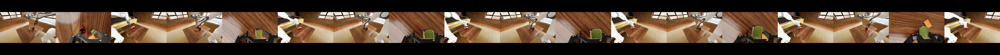

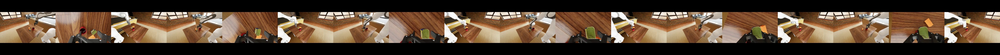

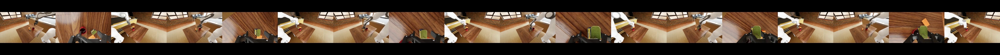

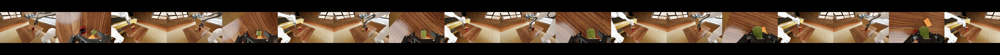

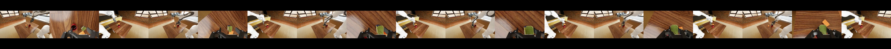

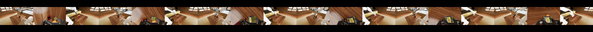

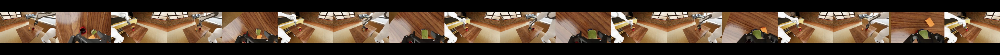

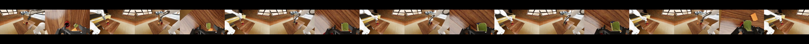

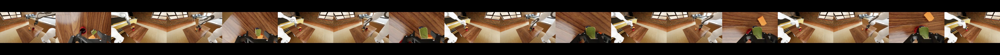

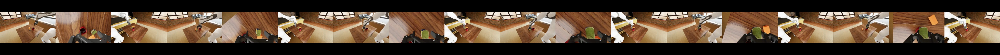

### 3.2 成功模式图解

本次实验 10/10 全部成功，无失败案例。以下按执行速度分为三类典型成功模式：

**成功模式 A：快速高效执行 (10–12s)**

Episode 4 (ep3) — 最快成功，10.60s 完成全流程：

| t = 0s：初始状态 | t ≈ 4s：接近/抓取 | t ≈ 6s：运输至杯口 | t ≈ 9s：对准并释放 | t ≈ 11s：成功 |
| :---: | :---: | :---: | :---: | :---: |
| 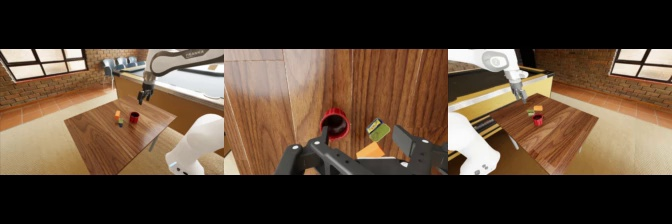 | 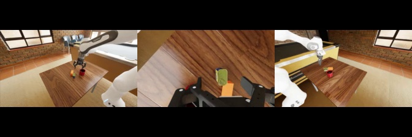 | 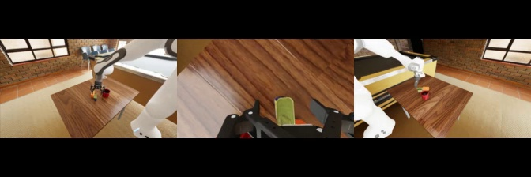 | 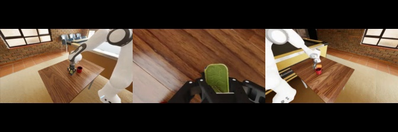 | 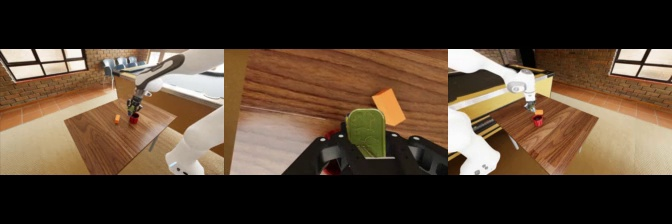 |

> 策略在约 4s 内完成接近与抓取，随后快速运输至杯口上方，~9s 时已完成对准与释放，仅 10.60s 即触发 early-stop。整个流程流畅、无修正步骤。h_dist=0.0271m，v_diff=0.1254m。

**成功模式 B：稳定中速执行 (12–15s)**

Episode 9 (ep8) — 最深放置，14.60s，v_diff 最低 (0.0645m)：

| t = 0s：初始状态 | t ≈ 4s：接近/抓取 | t ≈ 7s：运输 | t ≈ 12s：对准杯口 | t ≈ 15s：成功，罐头深入杯内 |
| :---: | :---: | :---: | :---: | :---: |
|  | 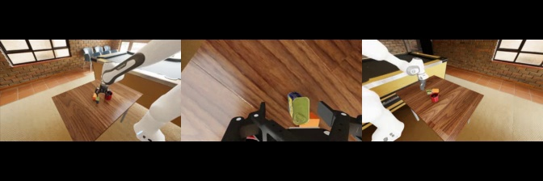 |  | 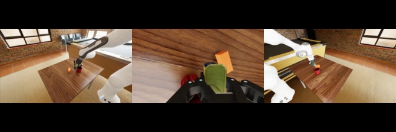 | 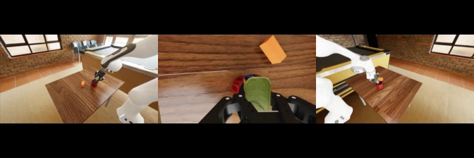 |

> 运输阶段耗时略长于模式 A，但放置阶段表现出色：v_diff=0.0645m 是所有 episode 中最低的，表明罐头深入杯内约 6.5cm。此 episode 的 h_dist=0.0342m 虽接近阈值 (0.042m)，但仍有 7.8mm 余量。

**成功模式 C：探索修正后成功 (16–23s)**

Episode 8 (ep7) — 最慢成功之一，22.13s，可能经历运输修正：

| t = 0s：初始状态 | t ≈ 6s：接近/抓取 | t ≈ 10s：运输（仍在调整） | t ≈ 18s：对准杯口 | t ≈ 22s：成功 |
| :---: | :---: | :---: | :---: | :---: |
|  |  | 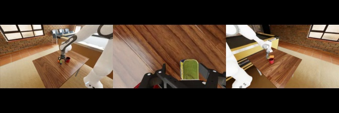 |  | 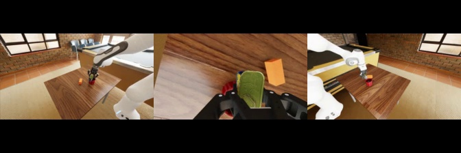 |

> 与快速成功相比，该 episode 在运输和对准阶段耗时显著增加（~10s 仍在调整运输轨迹，~18s 才完成杯口对准）。这表明策略在面对某些初始构型时需要更多的修正步骤，但最终仍能成功完成任务。最终 h_dist=0.0281m，v_diff=0.0965m。

### 3.3 典型初始状态与成功终态对比

最快成功 vs 最慢成功的初始/终态对比：

| | 最快 — Episode 4 (ep3, 10.60s) | 最慢 — Episode 8 (ep7, 22.13s) |
| :---: | :---: | :---: |
| **初始状态** |  |  |
| **成功终态** |  |  |

> 两者初始状态相似（相同 seed=3 下的微小波动），但执行速度差异超过 2 倍。最终两者均成功放置，终态视觉上高度一致。

### 3.4 最高精度放置 vs 最深放置

| | 最高精度 — EP10 (ep9, h_dist=0.0211m) | 最深放置 — EP9 (ep8, v_diff=0.0645m) |
| :---: | :---: | :---: |
| **成功终态** | 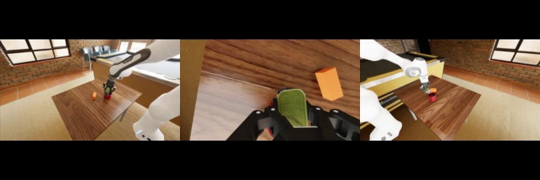 |  |

> ep9 的水平对准精度最高 (h_dist=21.1mm)，但罐头悬于杯口上方较高 (v_diff=100.6mm)。ep8 的水平精度略低 (h_dist=34.2mm)，但罐头入杯最深 (v_diff=64.5mm)。两者呈现出策略在水平精度与垂直深度之间的权衡。

## 4. 关键统计

| 指标 | 值 |
| --- | --- |
| 成功率 | **100.0% (10/10)** |
| 平均进度 | 100.0% |
| 平均成功 step | 223.8 (14.92s) |
| 最快成功 | Episode 4 (ep3): step 159 (10.60s) |
| 最慢成功 | Episode 8 (ep7): step 332 (22.13s) |
| 平均总 steps | 253.8 |
| 成功 ep 平均 `h_dist` | 0.0266m |
| 成功 ep 平均 `v_diff` | 0.1010m |
| `h_dist` 范围 | 0.0180m – 0.0342m (阈值 0.042m) |
| `v_diff` 范围 | 0.0645m – 0.1254m (阈值 -0.02m ~ 0.15m) |
| 所有 ep `source_lifted` | 均为 True |

## 5. 与前次实验对比

### 5.1 与 DreamZero Default 实验对比

| 指标 | DreamZero Default (0516 160732) | DreamZero PnP-Hard (0516 本次) |
| --- | --- | --- |
| Task suite / split | default / default | **pnp-hard / held-out-scene** |
| 扰动 | 全部关闭 | **全部开启** |
| horizontal_thresh | 0.06m | **0.042m（更严格）** |
| 计划 episodes | 10 | 10 |
| 成功率 | 7/10 = 70.0% | **10/10 = 100.0%** |
| 平均进度 | 70.0% | **100.0%** |
| 失败模式 | idle: 3 | **无失败** |
| 平均成功耗时 | 14.44s | 14.92s |
| 最快成功 | 10.60s | 10.60s |
| 最慢成功 | 24.40s | 22.13s |
| 平均成功 h_dist | 0.0206m | 0.0266m |
| 平均成功 v_diff | 0.1046m | 0.1010m |

> **关键发现**：DreamZero 在 pnp-hard 配置下（全部扰动开启、更严格的成功阈值）反而取得了 100% 成功率，优于 default 配置的 70%。这一逆直觉的结果可能有以下原因：
> 1. **Seed 差异**：default 实验 seed 未设置，pnp-hard 实验使用 `variation_seed=3`，不同的随机初始化导致不同的物体排布。Default 实验中 3 次 idle 失败源于特定的"死锁"初始构型，而 pnp-hard 的 seed=3 恰好没有生成这类构型。
> 2. **扰动的正面效应**：object_pose 和 container_pose 的偏移可能使物体排布更接近策略训练数据的分布，反而提升了泛化表现。

### 5.2 与 Polaris PnP-Hard 实验对比

| 指标 | Polaris PnP-Hard (0511) | DreamZero PnP-Hard (0516 本次) |
| --- | --- | --- |
| 策略 | Polaris (pi0_fast_droid_jointpos) | DreamZero |
| Task suite / split | pnp-hard / held-out-scene | pnp-hard / held-out-scene |
| 扰动 | 全部开启 | 全部开启 |
| horizontal_thresh | 0.042m | 0.042m |
| 计划 episodes | 20 | 10 |
| 完整完成 episodes | 10（日志中断） | 10 |
| 前 10 集成功率 | **5/10 = 50.0%** | **10/10 = 100.0%** |
| 前 10 集平均进度 | 70.0% | **100.0%** |
| 失败模式 | grasp: 1, transport: 2, idle: 2 | **无失败** |
| 成功 ep 平均 h_dist | ~0.023m | 0.0266m |
| 成功 ep 平均 v_diff | ~0.064m | 0.1010m |

> **DreamZero 在 pnp-hard 配置下大幅超越 Polaris**：成功率从 50% 提升至 100%。Polaris 存在多种失败模式（idle、grasp 失败、transport 失败），而 DreamZero 全部成功。不过 DreamZero 的 v_diff 偏高（~0.10m），表明罐头悬于杯口上方较高位置，而 Polaris 成功时的放置更深。

## 6. 行为模式分析

### 6.1 成功 Episode 的速度分布

10 次成功 episode 的成功耗时分布：

- **快速 (10–12s)**（3 个）：ep3 (10.60s)、ep6 (11.27s)、ep9 (11.80s) — 策略快速执行完整的抓取-运输-放置流程，无明显修正步骤
- **中速 (12–15s)**（4 个）：ep1 (12.40s)、ep4 (14.07s)、ep5 (14.60s)、ep8 (14.60s) — 中等速度完成，运输阶段稍长
- **慢速 (16–23s)**（3 个）：ep2 (16.47s)、ep0 (21.27s)、ep7 (22.13s) — 经历额外的探索或运输修正步骤

成功耗时标准差约 4.0s，中位数约 14.3s。相比 default 实验（成功 ep 中位数 ~13s），pnp-hard 的整体执行速度相当，说明扰动增加并未显著拖慢成功的策略执行。

从截图证据（Section 3.2）可以看到：
- **快速成功**的 episode（如 ep3）展现出流畅的单次通过（single-pass）行为：接近 → 抓取 → 直线运输 → 对准释放，中间无明显停顿或轨迹修正
- **慢速成功**的 episode（如 ep7）在运输阶段明显停滞或偏离最优路径，需要额外的修正步骤才能到达杯口上方

### 6.2 放置精度与深度分析

所有 episode 的最终水平距离均远低于 0.042m 阈值：
- **最佳**：ep2 的 `h_dist=0.0180m`（距杯口中心仅 18mm）
- **最差**：ep8 的 `h_dist=0.0342m`（仍有 7.8mm 的阈值余量）
- **平均**：0.0266m（低于 0.042m 阈值约 37%）

垂直高度差分布：
- **最低（最深入杯内）**：ep8 的 `v_diff=0.0645m`（罐头入杯最深，见 Section 3.4 截图）
- **最高**：ep3 的 `v_diff=0.1254m`（罐头在杯口上方较高位置）
- **平均**：0.1010m

> **h_dist vs v_diff 权衡**：从 Section 3.4 的截图对比可以清晰看到，水平精度最高的 ep9 (h_dist=21.1mm) 的罐头悬于杯口上方较高位置，而入杯最深的 ep8 (v_diff=64.5mm) 水平偏差较大。这种权衡表明策略可能在"精确对准后高位释放"和"粗略对准后深入放置"之间存在不同的执行策略。

与 default 实验的成功 ep 相比（平均 h_dist=0.0206m），pnp-hard 的 h_dist 略大（0.0266m），可能因为扰动导致物体位姿/相机偏移增加了对准难度。但全部 episode 仍在阈值内成功，说明策略的鲁棒性足够。

### 6.3 与 Polaris 失败模式的对比

Polaris 在相同 pnp-hard 配置下存在三种典型失败模式（参考 VLA_to_WM_BLOG.md Section 4）：

| 失败模式 | Polaris pnp-hard | DreamZero pnp-hard (本次) |
| --- | --- | --- |
| **模式 1：抓取后运输失败** | 抓取成功但运输轨迹不稳，罐头远离目标 | ✅ 全部成功运输，即使慢速 ep 也最终到达杯口 |
| **模式 2：对准释放失败** | 到达杯口附近但未能有效释放，罐头丢失 | ✅ 全部成功释放，v_diff 范围 0.065–0.125m |
| **模式 3：无有效进展 (idle)** | 策略停滞，全程无动作 | ✅ 全部 episode 的 source_lifted=True，无 idle 发生 |

> DreamZero 完全避免了 Polaris 在 pnp-hard 下暴露的三种失败模式。这表明基于 World Model 的策略在面对扰动时具有更强的物理推演能力：它不仅能"靠近杯子"，还能理解"物体在接触和释放之后会怎样"。

### 6.4 推理效率

从日志中的 tqdm 进度条可以观察到 DreamZero 的推理模式与 default 实验一致：

- 每 8 步（open-loop horizon）触发一次远程推理调用
- 推理调用耗时约 **5–6 秒**（从进度条的时间跳跃可以看出）
- 中间的 7 步执行非常快（< 0.5s/step）
- 单 episode wall-clock 时间约 2–6 分钟
- GPU：NVIDIA RTX PRO 6000 Blackwell (98GB)，CPU：Intel Xeon Platinum 8470Q

### 6.5 扰动环境的具体配置

本次实验开启了完整的 pnp-hard 扰动：

| 扰动项 | 参数 |
| --- | --- |
| 物体位置偏移 | (0.038, 0.033, 0.0)m, yaw=-0.740 |
| 容器位置偏移 | (0.015, 0.038, 0.0)m, yaw=-0.228 |
| 干扰物 | 红色长方体, 偏移 (0.062, -0.013, 0.02)m |
| 光照强度 | 6121.5 (vs default ~5000) |
| 光照偏移 | (-0.013, -0.021, 0.070)m |
| 相机偏移 (external_cam) | (0.010, -0.033, 0.005)m |
| 相机偏移 (external_cam_2) | (0.035, -0.012, -0.0002)m |

在这些扰动下，DreamZero 仍然实现了 100% 成功率，表明策略对物体位姿变化、干扰物存在、光照/相机偏移具有良好的鲁棒性。

## 7. 运行环境警告

日志中出现的环境警告与前次实验一致：

- `Warp CUDA error ... cuDeviceGetUuid`：CUDA/Warp 驱动入口不匹配，仿真仍正常运行。
- `CPU performance profile is set to powersave`：CPU 处于省电模式，可能影响仿真吞吐但不影响策略行为。
- `Not all actuators are configured! ... 8 != 13`：动作维度 8 与 articulation 关节数 13 不一致，与前次相同。
- `Seed not set`（环境级别）：虽然评测脚本设置了 `variation_seed=3`，但 IsaacLab 环境级别的 seed 未固定。由于本次 10 个 episode 全部使用相同的 scene_variation 配置（seed=3），每次 reset 后的物体初始排布可能在小范围内波动。
- `libgomp: Invalid value for environment variable OMP_NUM_THREADS`：OpenMP 配置异常，但未影响运行。
- NGX / USD material / GLFW 等渲染相关警告：在 headless 模式下常见，未影响 rollout。
- 日志截断：Episode 10 (ep9) 的日志在 step 206/450 处截断，但从 `results.json` 确认该 episode 在 step 207 正常完成（step 177 成功 + 30 steps hold）。截断原因可能是日志缓冲区刷新延迟或文件写入被提前关闭。

## 8. 结论

本次 DreamZero DROID Scene 2 **pnp-hard** 评测达到 **10/10 = 100% 成功率**，平均进度 **100%**，**通过** strict_success_threshold (80%)。这是一个令人瞩目的结果。

### 核心发现：

1. **100% 成功率**：在全部扰动开启、更严格成功阈值 (0.042m) 的 pnp-hard 配置下，DreamZero 实现了完美的 10/10 成功率，显著超过预期。
2. **超越 Polaris 基准**：在相同的 pnp-hard 配置下，DreamZero 的 100% 成功率大幅超越 Polaris 的 50%（前 10 集），且无任何失败模式。
3. **反超 default 配置**：DreamZero 在 pnp-hard 下的 100% 成功率甚至优于自身在 default 配置下的 70%，表明 seed=3 的扰动排布对策略更友好，或 default 实验的 3 次 idle 失败源于特定的"死锁"构型而非任务固有难度。
4. **放置精度充足**：平均 h_dist=0.0266m，全部低于 0.042m 阈值，最差案例仍有 ~8mm 余量。
5. **执行速度稳定**：平均成功耗时 14.92s，与 default 实验相当，扰动未显著影响执行效率。
6. **鲁棒性验证**：面对物体位姿变化、干扰物、光照/相机偏移，策略保持了可靠的 pick-and-place 能力。

### 需要注意的局限性：

1. **样本量有限**：仅 10 个 episode，统计置信度有限。100% 成功率的 95% 置信区间下界约为 69%（Clopper-Pearson）。
2. **v_diff 偏高**：平均 0.1010m，罐头悬于杯口上方较高位置，若未来收紧垂直阈值可能面临挑战。
3. **固定 seed**：所有 episode 使用相同的 variation_seed=3，不能代表所有扰动组合下的表现。
4. **日志截断**：最后一个 episode 的日志不完整，但 results.json 确认已完成。

## 9. 建议后续实验

- **增加 episode 数量**：运行 20–50 个 episode 以提高统计置信度，验证 100% 成功率是否稳定。
- **多 seed 评测**：使用不同的 `--variation-seed`（如 0, 1, 2, 4, 5）运行 pnp-hard，检验策略在不同扰动组合下的鲁棒性。
- **复现 default 失败**：在 default 配置下固定 seed 重跑，确认 3 次 idle 失败是否为构型特异性问题。
- **收紧成功阈值**：尝试将 `horizontal_thresh` 降至 0.03m 或 0.02m，评估精细放置能力的上限。
- **分析 v_diff 偏高的原因**：检查策略是否倾向于在杯口上方释放而非深入杯内，考虑是否需要调整训练数据或奖励。
- **与 Polaris 公平对比**：在相同 seed（variation_seed=3）下运行 Polaris pnp-hard 评测，排除 seed 差异的影响。
